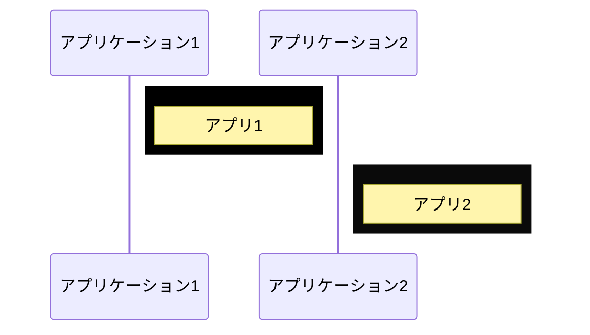

# test_repo

```mermaid
sequenceDiagram
  participant app1 as アプリケーション1
  participant app2 as アプリケーション2
  rect rgb(0, 0, 0)
    Note right of app1: アプリ1
  end
  rect rgb(10,10,10)
    Note right of app2: アプリ2
  end
```

## modify 1

* list 1
* list 2

## modify 2

* list 3
* list 4

## modify 3

* list 5
* list 6

## modify 4
